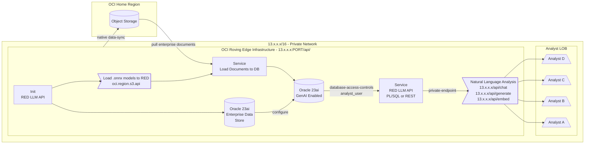

# Examples of using 23ai with OLLAMA
This guide is for reference only and research examples only. This is not intended for production systems or official Oracle guidance.

## High-Level


## Prerequisites

An Ubuntu system with an NVIDIA GPU installed.
Internet access for package downloads.
Administrative privileges for package installation and system restarts.

## Ansible Setup
Examples at `./examples/ansible/*`

To run a playbook:
- Save the above content to a file named `ubuntu_ol_nvidia_driver_install.yml`
- Ensure Ansible is installed on your control machine.

Run the playbook with the command: `ansible-playbook ubuntu_ol_nvidia_driver_install.yml`

This will automate the installation of the NVIDIA GPU driver, configuration of the Ollama AI platform, and setup of the necessary services at the Edge.

## Bash Setup
Reference `./examples/bash/*` for full shell script examples. To execute use `chmod +x ubuntu-ol-nvidia-driver-install.sh` then execute with either `bash ubuntu-ol-nvidia-driver-install.sh` or `./ubuntu-ol-nvidia-driver-install.sh`

## Manual Installation Guide
***Step 1: Check GPU Devices***
- Use the following command to check the GPU devices connected to your system and the appropriate drivers:
```bash
ubuntu-drivers devices
```
***Step 2: Install NVIDIA Library Packages***
Install the necessary NVIDIA library packages with the following commands:
```bash
sudo apt install libnvidia-common-535
sudo apt-get -y install libnvidia-gl-535
```
***Step 3: Install NVIDIA Driver***
Install the NVIDIA driver package specifically for servers:
```bash
sudo apt install nvidia-driver-535-server
```
***Step 4: Reboot System***
After installing the driver, reboot your system for the changes to take effect:
```bash
sudo reboot
```
***Step 5: Validate Driver Installation***
Post-reboot, validate that the NVIDIA driver is installed and functioning correctly:
```bash
nvidia-smi
```
You should see output displaying information about your GPU, indicating a successful installation.
***Step 6: Install Ollama AI Platform***
Install the Ollama AI platform by running the following command:
```bash
curl -fsSL https://ollama.com/install.sh | sh
```
***Step 7: Configure Ollama Service***
Edit the ollama.service file to configure the Ollama service:
```bash
vi /etc/systemd/system/ollama.service
```
Add the following lines to the [Service] section of the file:
```bash
Environment=OLLAMA_HOST=0.0.0.0
Environment=OLLAMA_KEEP_ALIVE=-1
```
***Step 8: Open Firewall Port***
Allow incoming connections to the Ollama service port:
```bash
sudo iptables -A INPUT -p tcp --dport 11434 -j ACCEPT
sudo -s iptables-save -c
```
***Step 9: Reload and Restart Services***
Reload the systemd daemon and restart the Ollama service:
```bash
sudo systemctl daemon-reload
sudo systemctl restart ollama.service
```
***Step 10: Check Service Status***
Use the netstat command to verify that the Ollama service is listening on the specified port:
```bash
netstat -tulpn
```
Look for a line indicating that a process is listening on port 11434.
***Step 11: Pull and Use a Model***
Pull one of the available models from the Ollama platform:
```bash
ollama pull llama3:8b
```
Then, you can use the pulled model to generate outputs:
```bash
curl http://IP:11434/api/generate -d '{"model": "llama3", "keep_alive": -1}'
```
Replace IP with the actual IP address of your system.

## PL/SQL
Reference the sequence inside `./examples/sql` for leveraging the LLM service inside Oracle 23ai.


### Contributors
- Tobalo Torres-Valderas
- Tim Cline